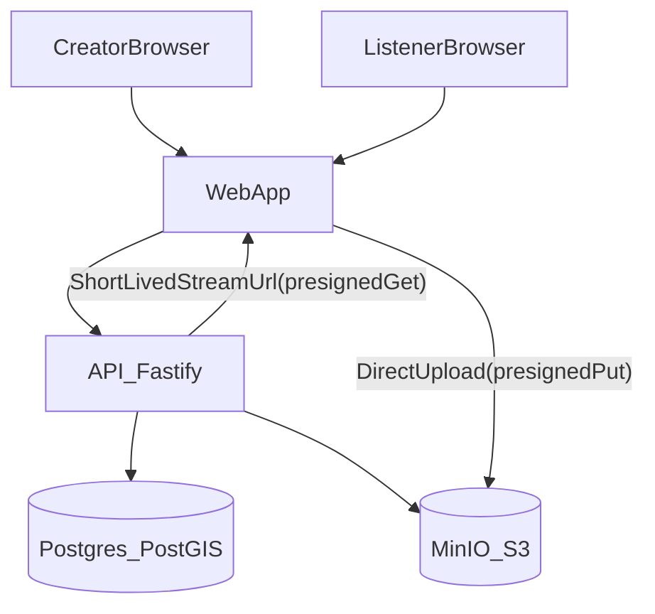

# Architecture

## Goal

Allow listening to audio **only when physically inside a geofence**. Creators upload audio, attach it to geofences, and group stops into tours.

This MVP is built as a web app + API, but it is designed so it can be turned into iOS/Android later (same API, JWT tokens, same DB model), with a future “tour bundle” download for offline use.

## Components

- **`apps/web`** (Next.js): Listener + Creator UI, Google Maps (click-to-place geofences, map markers with info popups)
- **`apps/api`** (Fastify): auth, geofence checks, tour management, S3/MinIO signing
- **Postgres + PostGIS**: stores geofences, tours, and metadata; performs spatial queries
- **MinIO (S3)**: stores audio objects; the API issues short-lived signed URLs

## Data flow

## Geofencing enforcement

The API gates audio playback by only returning a signed streaming URL when the user is within the geofence.

The core PostGIS check is:

\[
ST\\_DWithin(center\\_geog, user\\_point\\_geog, radius\\_m)
\]

In code this is executed with:

- `ST_SetSRID(ST_MakePoint(lng,lat),4326)::geography`
- `ST_DWithin(geofences.center_geog, ..., geofences.radius_m)`

## Storage strategy (MinIO)

- Creator uploads use **pre-signed PUT** URLs (web uploads directly to MinIO).
- Listener playback uses **pre-signed GET** URLs (short TTL).

This keeps the API from proxying audio bytes (simpler MVP, scalable later).

## Offline/mobile path (future)

Not implemented in this MVP, but the model supports it:

- A future endpoint like `GET /tours/:id/bundle` can return a manifest plus signed URLs for downloading each stop’s audio.
- Mobile clients can store the bundle and play audio offline while still using GPS.

